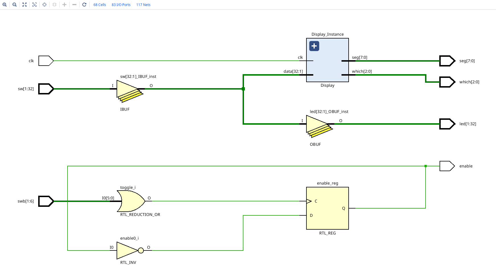
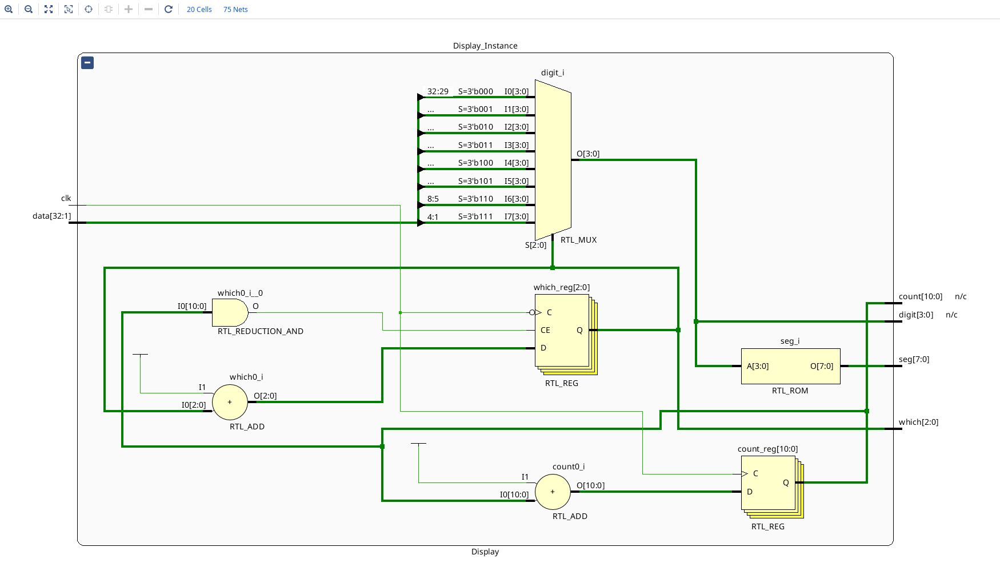
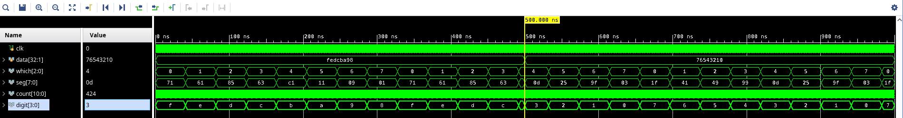

# 测试实验

- 将开关输入数据直接输出到 LED 和数码管，测试三者的可用性；
- 按下任意按钮，切换数码管使能，测试按钮可用性。

涉及到的知识：
- Verilog 基本语法、模块的仿真测试、实例化调用等;
- Xilinx Vivado 开发环境的简单使用。

## RTL Schematic

### Board:

### Display:

## Simulation

### Display:

