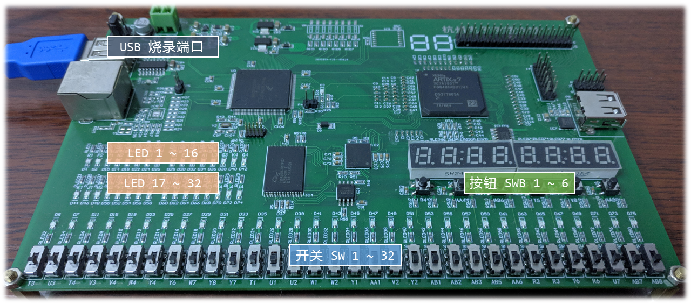

# 开发环境

[Xilinx Vivado](https://www.xilinx.com/products/design-tools/vivado.html) WebPACK 2018.3 (64-bit)

> Vivado 项目路径仅支持 ASCII 字符，请注意避免使用中文路径。

## 编辑器

代码文件均使用 `UTF-8` 编码及 `LF` 行尾。Vivado 内置编辑器功能十分有限，建议使用第三方编辑器，相关配置项：`Tools`/`Settings`/`Text Editor`/`Current Editor`/`Custom Editor`。

推荐使用 [Visual Studio Code](https://code.visualstudio.com/download)，对应的第三方编辑器配置定义：`/path/to/vscode -g [file name]:[line number]`，如`"C:\Users\liolok\AppData\Local\Microsoft VS Code\Code.exe" -g [file name]:[line number]`。

VS Code 相关扩展：
- [Verilog HDL - Visual Studio Marketplace](https://marketplace.visualstudio.com/items?itemName=leafvmaple.verilog)（`*.v`）
- [Tcl - Visual Studio Marketplace](https://marketplace.visualstudio.com/items?itemName=sleutho.tcl)（`*.xdc`）

## 比特流烧录

项目生成的比特流文件位于`<project>/<project>.runs/impl_1`，如`01_Test/01_Test.runs/impl_1/Board.bit`。

由于实验板卡并不支持 Vivado 内置的烧录功能，上游提供了专门的烧录工具，仅支持 Windows 平台。文件参见：[`BitstreamDownloader.exe`](docs/BitstreamDownloader.exe)。

> 如烧录工具无法运行，需安装 Microsoft Visual C++ 可再发行程序包，即微软运行库。推荐下载安装[这个合集](https://tiny.cc/vcredist)，原帖链接：[Visual C++ Redistributables AIO - Repacks.NET](https://repacks.net/viewtopic.php?t=247)。

# 实验板卡

[Xilinx Artix-7](https://www.xilinx.com/products/silicon-devices/fpga/artix-7.html) xc7a100tfgg484-2L

USB 烧录端口驱动：

- 官方网站：[CH341SER.EXE - 江苏沁恒股份有限公司](http://www.wch.cn/download/CH341SER_EXE.html)
- 外网备份：[CH340 Drivers for Windows, Mac and Linux](https://sparks.gogo.co.nz/ch340.html)

# 配置管脚

> Xinlinx 官方资料: [https://www.xilinx.com/support/packagefiles/a7packages/xc7a100tfgg484pkg.txt](https://www.xilinx.com/support/packagefiles/a7packages/xc7a100tfgg484pkg.txt)

## 快速索引

- [时钟](#时钟)
- [开关*32](#开关32)
- [按钮*6](#按钮6)
- [LED*32](#led32)
- [数码管*8](#数码管8)

## 时钟

实验板的系统时钟从 FPGA 的`H4`引脚接入，其对应的 Pin Name(Site Type) 为`IO_L12P_T1_MRCC_35`。

- 如需连续提供的时钟脉冲（如扫描数码管），可接入获得系统时钟。如需更低的频率，可使用系统时钟进行计数，达到延时、分频的目的。
- 如需手动控制的时钟脉冲（如切换运算符），可接入下文中的开关`SW`或按钮`SWB`。其中 32 个开关需要用户在接入后自行处理抖动，否则可能得到稳定性较差的脉冲；6 个按钮则均已硬件消抖，更推荐用作脉冲。

## 开关*32

表格说明：

- `PCB`为电路级别的引脚编号，在[板卡图片](#实验板卡)中已标出对应位置；
- `Pin`为 FPGA 级别的引脚编号，在**约束文件**中配置管脚时将会填写这一项，如`set_property PACKAGE_PIN T3 [get_ports {sw[32]}]`；
- `Pin Name / Site Type`为芯片级别的引脚名称，前者出自上文的 Xilinx [官方资料](#配置管脚)，后者出自 Vivado 的 I/O Ports 查询窗口。

> 每个开关上方均对应一个指示灯，用于指示开关当前状态，亮为高电平，灭为低电平。

|  PCB  |  Pin | Pin Name / Site Type |
| :---: | ---: | :------------------- |
| SW01  |   T3 | IO_0_34              |
| SW02  |   U3 | IO_L6P_T0_34         |
| SW03  |   T4 | IO_L13N_T2_MRCC_34   |
| SW04  |   V3 | IO_L6N_T0_VREF_34    |
| SW05  |   V4 | IO_L12P_T1_MRCC_34   |
| SW06  |   W4 | IO_L12N_T1_MRCC_34   |
| SW07  |   Y4 | IO_L11P_T1_SRCC_34   |
| SW08  |   Y6 | IO_L18P_T2_34        |
| SW09  |   W7 | IO_L19N_T3_VREF_34   |
| SW10  |   Y8 | IO_L23P_T3_34        |
| SW11  |   Y7 | IO_L23N_T3_34        |
| SW12  |   T1 | IO_L1P_T0_34         |
| SW13  |   U1 | IO_L1N_T0_34         |
| SW14  |   U2 | IO_L2P_T0_34         |
| SW15  |   W1 | IO_L5P_T0_34         |
| SW16  |   W2 | IO_L4P_T0_34         |
| SW17  |   Y1 | IO_L5N_T0_34         |
| SW18  |  AA1 | IO_L7P_T1_34         |
| SW19  |   V2 | IO_L2N_T0_34         |
| SW20  |   Y2 | IO_L4N_T0_34         |
| SW21  |  AB1 | IO_L7N_T1_34         |
| SW22  |  AB2 | IO_L8N_T1_34         |
| SW23  |  AB3 | IO_L8P_T1_34         |
| SW24  |  AB5 | IO_L10N_T1_34        |
| SW25  |  AA6 | IO_L18N_T2_34        |
| SW26  |   R2 | IO_L3N_T0_DQS_34     |
| SW27  |   R3 | IO_L3P_T0_DQS_34     |
| SW28  |   T6 | IO_L17N_T2_34        |
| SW29  |   R6 | IO_L17P_T2_34        |
| SW30  |   U7 | IO_25_34             |
| SW31  |  AB7 | IO_L20P_T3_34        |
| SW32  |  AB8 | IO_L22N_T3_34        |

[*返回索引*](#快速索引)

## 按钮*6

> 按下为高电平，松开位低电平。

|  PCB  |  Pin | Pin Name / Site Type |
| :---: | ---: | :------------------- |
| SWB1  |   R4 | IO_L13P_T2_MRCC_34   |
| SWB2  |  AA4 | IO_L11N_T1_SRCC_34   |
| SWB3  |  AB6 | IO_L20N_T3_34        |
| SWB4  |   T5 | IO_L14P_T2_SRCC_34   |
| SWB5  |   V8 | IO_L21N_T3_DQS_34    |
| SWB6  |  AA8 | IO_L22P_T3_34        |

[*返回索引*](#快速索引)

## LED*32

|  PCB  |  Pin | Pin Name / Site Type  |
| :---: | ---: | :-------------------- |
| LED01 |   R1 | IO_L20P_T3_35         |
| LED02 |   P2 | IO_L22P_T3_35         |
| LED03 |   P1 | IO_L20N_T3_35         |
| LED04 |   N2 | IO_L22N_T3_35         |
| LED05 |   M1 | IO_L15P_T2_DQS_35     |
| LED06 |   M2 | IO_L16N_T2_35         |
| LED07 |   L1 | IO_L15N_T2_DQS_35     |
| LED08 |   J2 | IO_L9N_T1_DQS_AD7N_35 |
| LED09 |   G1 | IO_L5P_T0_AD13P_35    |
| LED10 |   E1 | IO_L3P_T0_DQS_AD5P_35 |
| LED11 |   D2 | IO_L4N_T0_35          |
| LED12 |   A1 | IO_L1N_T0_AD4N_35     |
| LED13 |   L3 | IO_L14P_T2_SRCC_35    |
| LED14 |   G3 | IO_L11N_T1_SRCC_35    |
| LED15 |   K4 | IO_L13P_T2_MRCC_35    |
| LED16 |   G4 | IO_L12N_T1_MRCC_35    |
| LED17 |   K1 | IO_L7P_T1_AD6P_35     |
| LED18 |   J1 | IO_L7N_T1_AD6N_35     |
| LED19 |   H2 | IO_L8P_T1_AD14P_35    |
| LED20 |   G2 | IO_L8N_T1_AD14N_35    |
| LED21 |   F1 | IO_L5N_T0_AD13N_35    |
| LED22 |   E2 | IO_L4P_T0_35          |
| LED23 |   D1 | IO_L3N_T0_DQS_AD5N_35 |
| LED24 |   B1 | IO_L1P_T0_AD4P_35     |
| LED25 |   B2 | IO_L2N_T0_AD12N_35    |
| LED26 |   N3 | IO_L19N_T3_VREF_35    |
| LED27 |   M3 | IO_L16P_T2_35         |
| LED28 |   K3 | IO_L14N_T2_SRCC_35    |
| LED29 |   H3 | IO_L11P_T1_SRCC_35    |
| LED30 |   N4 | IO_L19P_T3_35         |
| LED31 |   L4 | IO_L18N_T2_35         |
| LED32 |   J4 | IO_L13N_T2_MRCC_35    |

[*返回索引*](#快速索引)

## 数码管*8

8 位七段数码管采用共阳极接法，并由内部译码器反相驱动。

### 8 位

|  PCB  |  Pin | Pin Name / Site Type    |
| :---: | ---: | :---------------------- |
|  DS0  |  N22 | IO_L15P_T2_DQS_15       |
|  DS1  |  M21 | IO_L10P_T1_AD11P_15     |
|  DS2  |  M22 | IO_L15N_T2_DQS_ADV_B_15 |
|  DS3  |  L21 | IO_L10N_T1_AD11N_15     |

`DS3`为全部数码管的使能信号，高电平有效；`DS2`、`DS1`、`DS0`通过 3-8 译码对 8 位数码管进行片选。如 [`DS2`, `DS1`, `DS0`] 为 `3b'111` 时，对应的十进制为 `7`，表示最左边即最高位数码管被选中并显示一个十六进制数码。

> 扫描数码管需注意：频率过低时扫描将会肉眼可见（效果同流水灯）；过高则会导致每位数码管分配到的周期太短而供电不足，亮度过低。建议在测试中调整分频因子以获得相对理想的扫描频率。

### 七段

|  PCB  |  Pin | Pin Name / Site Type  |
| :---: | ---: | :-------------------- |
| DS_a  |  H19 | IO_L12N_T1_MRCC_15    |
| DS_b  |  G20 | IO_L8N_T1_AD10N_15    |
| DS_c  |  J22 | IO_L7P_T1_AD2P_15     |
| DS_d  |  K22 | IO_L9N_T1_DQS_AD3N_15 |
| DS_e  |  K21 | IO_L9P_T1_DQS_AD3P_15 |
| DS_f  |  H20 | IO_L8P_T1_AD10P_15    |
| DS_g  |  H22 | IO_L7N_T1_AD2N_15     |
| DS_dp |  J21 | IO_L11N_T1_SRCC_15    |

各划的排序参见下图（取自[维基百科](https://zh.wikipedia.org/wiki/七劃管)）：

段选信号为低电平有效，如数码`0`对应`seg = 8b'0000_0011`（从高到低定义为a, b, c, ... g, dp）。

[*返回索引*](#快速索引)
