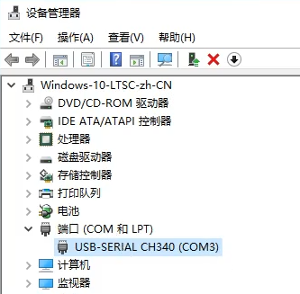
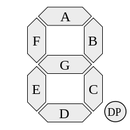

# 开发环境

[Xilinx Vivado][xilinx] WebPACK 2018.3，安装选项仅需选择 `Artix-7` 设备，最小安装应需将近 12GB 硬盘空间。

> Vivado 项目路径仅支持 ASCII 字符，请注意避免使用中文路径。

[xilinx]: https://www.xilinx.com/support/download.html "Downloads"

## 编辑器

代码文件均使用 `UTF-8` 编码及 `LF` 行尾。Vivado 内置编辑器功能十分有限，建议使用第三方编辑器，相关配置项：`Tools`/`Settings`/`Text Editor`/`Current Editor`/`Custom Editor`。

推荐使用 [Visual Studio Code][vscode]，对应的第三方编辑器配置定义：`/path/to/vscode -g [file name]:[line number]`，如 `"C:\Program Files\Microsoft VS Code\Code.exe" -g [file name]:[line number]`。

VS Code 相关扩展：
- [Verilog HDL 语法高亮][verilog]
- [Tcl 语法高亮][tcl]（需手动关联 `*.xdc` 约束文件为 Tcl 语法）

[vscode]: https://code.visualstudio.com/download "Download Visual Studio Code - Mac, Linux, Windows"
[verilog]: https://marketplace.visualstudio.com/items?itemName=kitkat.kitkat-verilog "Verilog-HDL Language Support - Visual Studio Marketplace"
[tcl]: https://marketplace.visualstudio.com/items?itemName=sleutho.tcl "Tcl - Visual Studio Marketplace"

# 实验板卡

[Xilinx Artix-7](https://www.xilinx.com/products/silicon-devices/fpga/artix-7.html) xc7a100tfgg484-2L

## 烧录端口驱动

Windows 驱动安装包参见文件 [`CH341SER.EXE`](docs/dependencies/CH341SER.EXE)（[出处][wch]）。

[wch]: http://www.wch.cn/download/CH341SER_EXE.html "CH341SER.EXE - 江苏沁恒股份有限公司"

在设备管理器中，正确驱动的板卡应如下图所示：

## 比特流烧录

项目生成的比特流文件位于 `<project>/<project>.runs/impl_1`，如 `01_Test/01_Test.runs/impl_1/Board.bit`。

由于实验板卡并不支持 Vivado 内置的烧录功能，上游提供了专门的烧录工具，仅支持 Windows 平台。文件参见：[`BitstreamDownloader.exe`](docs/BitstreamDownloader.exe)。

> 如烧录工具无法运行，应为缺少相应的微软 VC++ 运行库，可以安装[这个合集](docs/dependencies/VisualCppRedist_AIO_x86_x64.exe)（[出处][vcredist]）。

[vcredist]: https://github.com/abbodi1406/vcredist "abbodi1406/vcredist: AIO Repack for latest Microsoft Visual C++ Redistributable Runtimes"

# 配置管脚

## 快速索引

- [时钟](#时钟)
- [开关*32](#开关32)
- [按钮*6](#按钮6)
- [LED*32](#led32)
- [数码管*8](#数码管8)

## 时钟

实验板的系统时钟从 FPGA 的 `H4` 引脚接入，其对应的 Pin Name (Site Type) 为 `IO_L12P_T1_MRCC_35`。

- 如需连续提供的时钟脉冲（如扫描数码管），可接入获得系统时钟。如需更低的频率，可使用系统时钟进行计数，达到延时、分频的目的。
- 如需手动控制的时钟脉冲（如切换运算符），可接入下文中的开关 `SW` 或按钮 `SWB`。其中 32 个开关需要用户在接入后自行处理抖动，否则可能得到稳定性较差的脉冲；6 个按钮则均已硬件消抖，更**推荐用作脉冲**。

[*返回索引*](#配置管脚)

## 开关*32

表格说明：

- `PCB` 为电路级别的引脚编号，在[板卡图片](#实验板卡)中已标出对应位置；
- `Pin` 为 FPGA 级别的引脚编号，在**约束文件**中配置管脚时将会填写这一项，如 `set_property PACKAGE_PIN T3 [get_ports {sw[1]}]`；
- `Pin Name / Site Type` 为芯片级别的引脚名称，前者出自上文的 Xilinx [官方资料][packagefile]，后者出自 Vivado 的 I/O Ports 查询窗口。

[packagefile]: https://www.xilinx.com/support/packagefiles/a7packages/xc7a100tfgg484pkg.txt

> 每个开关上方均对应一个指示灯，用于指示开关当前状态，亮为高电平，灭为低电平。

| PCB  |   Pin | Pin Name / Site Type |
|:----:|------:|:---------------------|
| SW01 |  `T3` | IO_0_34              |
| SW02 |  `U3` | IO_L6P_T0_34         |
| SW03 |  `T4` | IO_L13N_T2_MRCC_34   |
| SW04 |  `V3` | IO_L6N_T0_VREF_34    |
| SW05 |  `V4` | IO_L12P_T1_MRCC_34   |
| SW06 |  `W4` | IO_L12N_T1_MRCC_34   |
| SW07 |  `Y4` | IO_L11P_T1_SRCC_34   |
| SW08 |  `Y6` | IO_L18P_T2_34        |
| SW09 |  `W7` | IO_L19N_T3_VREF_34   |
| SW10 |  `Y8` | IO_L23P_T3_34        |
| SW11 |  `Y7` | IO_L23N_T3_34        |
| SW12 |  `T1` | IO_L1P_T0_34         |
| SW13 |  `U1` | IO_L1N_T0_34         |
| SW14 |  `U2` | IO_L2P_T0_34         |
| SW15 |  `W1` | IO_L5P_T0_34         |
| SW16 |  `W2` | IO_L4P_T0_34         |
| SW17 |  `Y1` | IO_L5N_T0_34         |
| SW18 | `AA1` | IO_L7P_T1_34         |
| SW19 |  `V2` | IO_L2N_T0_34         |
| SW20 |  `Y2` | IO_L4N_T0_34         |
| SW21 | `AB1` | IO_L7N_T1_34         |
| SW22 | `AB2` | IO_L8N_T1_34         |
| SW23 | `AB3` | IO_L8P_T1_34         |
| SW24 | `AB5` | IO_L10N_T1_34        |
| SW25 | `AA6` | IO_L18N_T2_34        |
| SW26 |  `R2` | IO_L3N_T0_DQS_34     |
| SW27 |  `R3` | IO_L3P_T0_DQS_34     |
| SW28 |  `T6` | IO_L17N_T2_34        |
| SW29 |  `R6` | IO_L17P_T2_34        |
| SW30 |  `U7` | IO_25_34             |
| SW31 | `AB7` | IO_L20P_T3_34        |
| SW32 | `AB8` | IO_L22N_T3_34        |

[*返回索引*](#配置管脚)

## 按钮*6

> 按住时为高电平，松开时为低电平。

| PCB  |   Pin | Pin Name / Site Type |
|:----:|------:|:---------------------|
| SWB1 |  `R4` | IO_L13P_T2_MRCC_34   |
| SWB2 | `AA4` | IO_L11N_T1_SRCC_34   |
| SWB3 | `AB6` | IO_L20N_T3_34        |
| SWB4 |  `T5` | IO_L14P_T2_SRCC_34   |
| SWB5 |  `V8` | IO_L21N_T3_DQS_34    |
| SWB6 | `AA8` | IO_L22P_T3_34        |

[*返回索引*](#配置管脚)

## LED*32

|  PCB  |  Pin | Pin Name / Site Type  |
|:-----:|-----:|:----------------------|
| LED01 | `R1` | IO_L20P_T3_35         |
| LED02 | `P2` | IO_L22P_T3_35         |
| LED03 | `P1` | IO_L20N_T3_35         |
| LED04 | `N2` | IO_L22N_T3_35         |
| LED05 | `M1` | IO_L15P_T2_DQS_35     |
| LED06 | `M2` | IO_L16N_T2_35         |
| LED07 | `L1` | IO_L15N_T2_DQS_35     |
| LED08 | `J2` | IO_L9N_T1_DQS_AD7N_35 |
| LED09 | `G1` | IO_L5P_T0_AD13P_35    |
| LED10 | `E1` | IO_L3P_T0_DQS_AD5P_35 |
| LED11 | `D2` | IO_L4N_T0_35          |
| LED12 | `A1` | IO_L1N_T0_AD4N_35     |
| LED13 | `L3` | IO_L14P_T2_SRCC_35    |
| LED14 | `G3` | IO_L11N_T1_SRCC_35    |
| LED15 | `K4` | IO_L13P_T2_MRCC_35    |
| LED16 | `G4` | IO_L12N_T1_MRCC_35    |
| LED17 | `K1` | IO_L7P_T1_AD6P_35     |
| LED18 | `J1` | IO_L7N_T1_AD6N_35     |
| LED19 | `H2` | IO_L8P_T1_AD14P_35    |
| LED20 | `G2` | IO_L8N_T1_AD14N_35    |
| LED21 | `F1` | IO_L5N_T0_AD13N_35    |
| LED22 | `E2` | IO_L4P_T0_35          |
| LED23 | `D1` | IO_L3N_T0_DQS_AD5N_35 |
| LED24 | `B1` | IO_L1P_T0_AD4P_35     |
| LED25 | `B2` | IO_L2N_T0_AD12N_35    |
| LED26 | `N3` | IO_L19N_T3_VREF_35    |
| LED27 | `M3` | IO_L16P_T2_35         |
| LED28 | `K3` | IO_L14N_T2_SRCC_35    |
| LED29 | `H3` | IO_L11P_T1_SRCC_35    |
| LED30 | `N4` | IO_L19P_T3_35         |
| LED31 | `L4` | IO_L18N_T2_35         |
| LED32 | `J4` | IO_L13N_T2_MRCC_35    |

[*返回索引*](#配置管脚)

## 数码管*8

8 位七段数码管，采用共阳极接法，并由内部译码器反相驱动。

### 使能信号

全部 8 位数码管的使能信号，高电平有效。

| PCB |   Pin | Pin Name / Site Type |
|:---:|------:|:---------------------|
| DS3 | `L21` | IO_L10N_T1_AD11N_15  |

### 片选编码

通过 3-8 译码选择驱动 8 位数码管中的哪一位，低电平有效。

| PCB |   Pin | Pin Name / Site Type    |
|:---:|------:|:------------------------|
| DS2 | `M22` | IO_L15N_T2_DQS_ADV_B_15 |
| DS1 | `M21` | IO_L10P_T1_AD11P_15     |
| DS0 | `N22` | IO_L15P_T2_DQS_15       |

如 `{DS2, DS1, DS0}` 为 `3'b000` 时，**逻辑上**对应十进制的 `7`，表示最左边即最高位数码管被选中，并根据下文中的段选信号显示一个十六进制数码。

欲使 8 位数码管*在视觉上*同时显示 32 位二进制数据，需要以一定的频率循环片选信号，对数码管进行扫描刷新。

- 频率过低时，扫描过程将会肉眼可见，效果类似流水灯；
- 频率过高时，分配给每位数码管的周期太短，供电不足，亮度降低。

建议在测试实验中调整分频倍数以获得相对理想的扫描频率。

### 段选信号

选择点亮数码管的哪些笔划，低电平有效。

|  PCB  |   Pin | Pin Name / Site Type  |
|:-----:|------:|:----------------------|
| DS_a  | `H19` | IO_L12N_T1_MRCC_15    |
| DS_b  | `G20` | IO_L8N_T1_AD10N_15    |
| DS_c  | `J22` | IO_L7P_T1_AD2P_15     |
| DS_d  | `K22` | IO_L9N_T1_DQS_AD3N_15 |
| DS_e  | `K21` | IO_L9P_T1_DQS_AD3P_15 |
| DS_f  | `H20` | IO_L8P_T1_AD10P_15    |
| DS_g  | `H22` | IO_L7N_T1_AD2N_15     |
| DS_dp | `J21` | IO_L11N_T1_SRCC_15    |

各划的排序参见下图（[出处][七段数码管]）：

[七段数码管]: https://zh.wikipedia.org/wiki/七劃管 "七段数码管 - 维基百科，自由的百科全书"

如数码 `0` 对应的段选信号为 `8'b0000_0011`（从高到低约定为 a, b, c, ... g, dp）。

[*返回索引*](#配置管脚)
